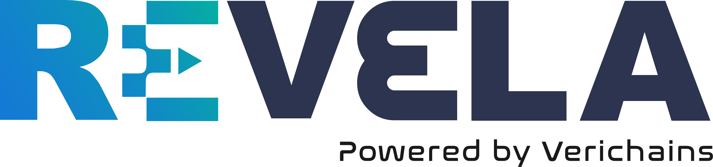

<p align="center">

</p>

**Revela Decompiler** is a tool to decompile Move smart contracts from low-level bytecode form back to high-level source code.

Revela is also available online at [revela.verichains.io](https://revela.verichains.io). Currently our decompiler is compatible with [Aptos](https://aptoslabs.com/) blockchain.

## About Us

[Verichains](https://verichains.io) is a leading blockchain security provider specializing in cryptanalysis, audits, and app security.

## Background

The groundbreaking [Move language](https://github.com/move-language/move) for smart contracts is revolutionizing the development of secure and resilient blockchains like Aptos. As contracts become more complex and play a vital role in safeguarding digital assets, it is essential to provide users with the means to verify the safety of the underlying code. Unfortunately, it becomes common to see Move-based protocols deployed solely in low-level bytecode form, without accompanying source code. This practice not only obfuscates the smart contracts’ functionality but also presents a significant barrier to security analysis, given that Move is a relatively new language and lacks tooling to easily analyze Move contracts.

In response to this challenge, Verichains has worked with Aptos Labs to develop Revela, the first-ever open-source tool designed to decompile Move bytecode back to its original source code, which can then be fed into the Move compiler once again. By empowering users to independently verify and analyze contract code, Revela establishes new industry standards for security, openness, and trust in the Aptos ecosystem.

## Build

Revela requires Rust compiler to build. From the root directory, execute the following command.

```
$ cargo build -p revela
```

The resulted binary `revela` can be found under the directory `target/debug`.

## Install

Run the following command to install Revela.

```
$ cargo install --path third_party/move/tools/revela
```

On MacOS and Linux, Revela is typically installed in directory `~/.cargo/bin`.
Ensure to have this path in your `PATH` environment variable so Revela can be executed from any location.
This step can be done with the below command.

```
$ export PATH=~/.cargo/bin:$PATH
```

## Usage

To decompile a Move bytecode file, pass its file path as a command line
argument using `--bytecode` (or `-b`), as shown below.

```
$ revela --bytecode <file_path>
```

For example:

```
$ revela --bytecode third_party/move/tools/revela/tests/bytecode/BasicCoin.mv
```

## License

Revela is released under the open source [Apache License](LICENSE)
